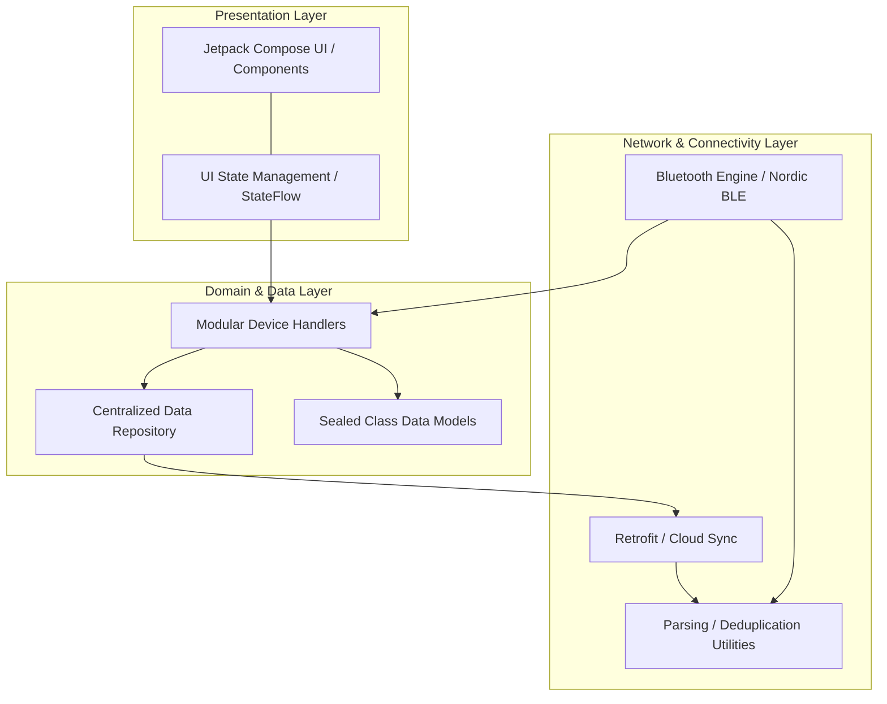

# BLESense Master Application Architecture & Operational Guide

Welcome to the comprehensive technical documentation for the **BLESense** Android Application. This guide details the complete system architecture, data flow pipelines, Bluetooth communication protocols, Jetpack Compose UI logic, and step-by-step operational workflows.

---

## 📐 1. System Architecture Overview

The **BLESense** app is built using modern Android development standards and follows a **Monolithic Module with Internal Package-based Modularity** approach:
- **UI Framework**: 100% Jetpack Compose with Material 3.
- **Language**: Kotlin (JDK 11 target).
- **Architecture Pattern**: MVVM (Model-View-ViewModel) powered by Kotlin `StateFlow` and `SharedFlow`.
- **Modularity**: Organized into clean architectural layers (API, Repository, Model, View, ViewModel) to ensure separation of concerns within a single `:app` module.
- **Decoupled Scanning Handlers**: Bluetooth scanning parsing logic is split into isolated component handlers implementing the `BleDeviceHandler` interface:
  - `SensorHubHandler`: Decodes SHT40, LIS3DH, sen66, BME680, etc.
  - `AwsSensorHandler`: Decodes weather telemetry.
  - `DataLoggerHandler`: Implements high-speed bundle parsing, blast round detection, and gap filling.
- **Bluetooth Stack**: 
    - **Nordic BLE**: Using `no.nordicsemi.android.kotlin.ble` for high-performance scanning and advertising.
    - **Classic Bluetooth**: RFCOMM Socket support for real-time hardware control.
- **Navigation**: Jetpack Compose Navigation (`NavHost` & `NavController`).

```
                              ┌───────────────────────────────────┐
                              │            MainActivity           │
                              └─────────────────┬─────────────────┘
                                                │
                                       ┌────────┴────────┐
                                       │   NavHost UI    │
                                       └────────┬────────┘
                                                │
        ┌───────────────────┬────────────────────┼────────────────────┬───────────────────┐
        ▼                   ▼                    ▼                    ▼                   ▼
 ┌──────────────┐   ┌──────────────┐     ┌──────────────┐     ┌──────────────┐    ┌───────────────┐
 │ Intermediate │   │ AWS Scanner  │     │ Home Screen  │     │ Data Logger  │    │ Robot Control │
 │ (Dashboard)  │   │ (Environmental)│   │ (Sensor Hub) │     │ (Logging)    │    │ (HUD Drive)   │
 └──────────────┘   └──────────────┘     └──────────────┘     └──────────────┘    └───────────────┘
        │                   │                    │                    │                   │
        └───────────────────┴────────────────────┼────────────────────┴───────────────────┘
                                                │
                                     ┌──────────┴──────────┐
                                     │ BluetoothViewModel  │
                                     └──────────┬──────────┘
                                                │
                 ┌──────────────────────────────┼──────────────────────────────┐
                 ▼                              ▼                              ▼
      ┌────────────────────┐         ┌────────────────────┐         ┌────────────────────┐
      │  BLE Scan Router   │         │  Targeted Trigger  │         │ RFCOMM Socket Hub  │
      │  (Direct Bypass)   │         │  (Advertise Mode)  │         │ (Robot Control)    │
      └──────────┬─────────┘         └────────────────────┘         └────────────────────┘
                 │
      ┌──────────┼──────────────────────────────┐
      ▼          ▼                              ▼
┌───────────┐┌───────────┐              ┌──────────────┐
│ SensorHub ││ AWS       │              │  DataLogger  │
│ Handler   ││ Handler   │              │  Handler     │
└───────────┘└───────────┘              └──────────────┘
```

---

## 🏗️ 2. App Modular Architecture (Internal Layers)

The project adheres to **Clean Architecture** principles by segregating code into logical layers within the package structure. The following diagram illustrates the unidirectional data flow and dependency hierarchy:



### 1. Presentation Layer (`view`, `viewmodel`)
- **View**: Jetpack Compose functions defining the UI. Organized into `screens` (full pages) and `components` (reusable widgets).
- **ViewModel**: Manages UI state using `StateFlow`. Handles user interactions and orchestrates data flow from repositories.
- **Stats Flows**: Rather than calculating counts and lists on the main Compose thread, statistics like `capturedCount`, `expectedCount`, and retry round summaries are calculated in the background inside handlers and exposed as StateFlows.

### 2. Domain/Data Layer (`model`, `repository`, `viewmodel/handler`)
- **Model**: Contains the "Source of Truth" data structures. Uses `Sealed Classes` (e.g., `SensorData`) to represent polymorphic sensor types.
- **BleDeviceHandler**: An interface defining a parser and handler. Decoupled handlers prevent modifications in one device type (e.g., DataLogger) from impacting others.

---

## 📁 3. Key File Directory & Responsibilities

| File Path | Description & Core Responsibility |
| :--- | :--- |
| `MainActivity.kt` | Entry point. Sets up Splash Screen and initializes the `AppNavigation` container. |
| `Navigation.kt` | Configures `NavHost` routes (`aws_scanner`, `home_screen`, `data_logger_control`, `robot_screen`). |
| `BluetoothScanViewModel.kt` | Central engine. Manages BLE scanning, routing, Targeted Trigger Advertisements, and delegates parsing to handlers. Features a direct synchronous route bypass for target DataLogger MAC addresses to prevent queue delays. |
| `BleDeviceHandler.kt` | Interface defining capability matching (`canHandle`) and processing (`handle`) for handlers. |
| `DataLoggerHandler.kt` | Manages DataLogger state, tracks blast rounds, performs gap filling, and exposes background-computed statistics. |
| `SensorHubHandler.kt` | Parser implementation for Sensor Hub peripherals. |
| `AwsSensorHandler.kt` | Decodes Autonomous Weather Station telemetry. |
| `SensorData.kt` | Sealed class architecture for all sensor types: `AWSData`, `SHT40`, `Sen66`, `LIS3DH`, `DataLoggerData`. |
| `DataLoggerScreen.kt` | High-speed data acquisition screen. Binds directly to state variables computed by `DataLoggerHandler`. |
| `RobotControlCompose.kt` | Futuristic Landscape HUD. Sends ASCII commands over Classic Bluetooth (RFCOMM) serial stream. |
| `RetrofitClient.kt` | Dual-cloud integration. Parallel uploads to **Render** and **Cloudflare** for remote telemetry monitoring. |

---

## 📡 4. Bluetooth Communication & Hardware Logic

### A. DataLogger Bundle-Based Triple-Blast Protocol

The firmware transfers records in bundles using chained extended advertisements to minimize packet loss:
1. **Packet Structure (246 bytes)**:
   - `Mfg[0-1]`: Unique Packet ID (16-bit little-endian)
   - `Mfg[2]`: Node ID (8-bit)
   - `Mfg[3-242]`: Accelerometer payload (80 x,y,z points)
   - `Mfg[243-244]`: Total packet count (16-bit little-endian)
   - `Mfg[245]`: Extra padding/round metadata
2. **Bundle Size**: 6 packets per bundle. The starting packet ID of a bundle defines the `bundleId`:
   $$\text{bundleId} = \text{packetId} - ((\text{packetId} - 1) \pmod 6)$$
3. **Triple Blast Spacing**:
   - Each bundle is advertised sequentially 3 times (blast retry rounds).
   - Same-bundle retry blasts occur within 100ms; new bundle transmissions start after 200ms.
4. **Blast Round Detection**:
   - The handler tracks `currentBundleId`. If the `bundleId` is unchanged and arrived within 150ms of the last packet in this bundle, it is categorized as a retry round (Round 2 or Round 3).
5. **Gap Filling & De-duplication**:
   - Packets are recorded using a global `BitSet`.
   - Retry rounds (Round 2 & 3) only record packet IDs that were missed in earlier rounds to prevent double-counting.
   - Captured Count is computed directly as the cardinality of unique packet IDs received:
     $$\text{Captured Count} = \text{Round 1} + \text{Round 2} + \text{Round 3}$$
   - Expected Count is calculated from the first received packet ID:
     $$\text{Expected Count} = \text{totalPackets} - \text{firstBundleId} + 1$$

### B. High-Speed Synchronous Routing Bypass
To prevent Android OS scanning pauses and thread queue choke-up:
- The Bluetooth scan callback synchronously intercepts advertisements matching the selected DataLogger target MAC address.
- These target packets are processed immediately, skipping the Coroutine queue to ensure 100% capture rate.
- The UI binds to pre-aggregated background stats variables to avoid rendering stutters.

---

## 📊 5. Data Processing Pipeline

1. **Reception**: `BluetoothLeScanner` captures raw bytes via `ScanCallback`.
2. **Parsing**: `BluetoothScanViewModel` decodes bytes based on Manufacturer ID `0x0059`.
3. **Model Mapping**: Raw data is mapped into `SensorData` child classes.
4. **UI Update**: `StateFlow` triggers recomposition in Jetpack Compose screens.
5. **Cloud Sync**: `sendToDashboard` function uploads packets to remote APIs asynchronously.

---

## 🚀 6. Development & Deployment

### Build Specifications
- **Compile SDK**: 35
- **Min SDK**: 29
- **Build Features**: Compose enabled, Proguard/R8 optimization active for Release.

### Key Gradle Dependencies
- `androidx.compose.material3`: Modern UI components.
- `no.nordicsemi.android.kotlin.ble`: Bluetooth core.
- `io.coil-kt:coil-compose`: Image loading.
- `androidx.navigation:navigation-compose`: App routing.

---

## 🛡️ 7. UI/UX Consistency
- **Themes**: Managed via `ThemeManager` (Light/Dark mode support).
- **Visuals**: Heavy use of custom `Canvas` drawing for weather gauges and HUD elements.
- **Orientation**: Robot Control is strictly locked to `sensorLandscape` via `AndroidManifest.xml`.

*Document refined for BLESense Android Architecture v1.1*
