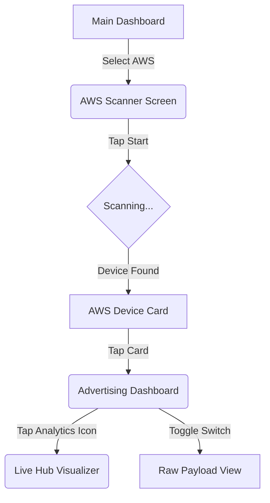

# AWS Autonomous Weather Station - User & Technical Manual

## 1. System Overview
The **AWS (Autonomous Weather Station)** is a specialized BLE sensor pod designed for environmental monitoring. It transmits high-precision data via Bluetooth Low Energy (BLE) advertising packets, allowing for real-time tracking without the overhead of a persistent connection.

---

## 2. Hardware Requirements & Device Compatibility
To ensure optimal performance and connectivity with the AWS pod, the following hardware requirements must be met:

### 2.1 Phone/Tablet Requirements
*   **Operating System**: Android 12.0 or higher.
*   **Bluetooth**: Support for Bluetooth Low Energy (BLE)  5.0+.
*   **Location Services**: GPS/Location must be enabled to facilitate Bluetooth discovery on Android devices.
*   **Memory**: Minimum 4GB RAM recommended for smooth visualization rendering.

### 2.2 Navigation Flow Diagram
The following flow describes the user journey within the BLE Sense application:

---

## 3. Technical Specifications
### 2.1 Environmental Sensors
*   **Temperature**: Range 0-50°C (Visualized with dynamic color coding: Blue < 15°C, Green 15-25°C, Red > 25°C).
*   **Humidity**: 0-100% relative humidity (Visualized with an animated water gauge).
*   **Anemometer**: Measures wind speed in m/s (App converts this to km/h for display).
*   **Wind Vane**: 360° direction sensing with 8-point compass interpolation (N, NE, E, SE, S, SW, W, NW).
*   **Rain Gauge**: Tracks cumulative RF (Rainfall) levels.

### 2.2 Power Management
*   **Battery Voltage**: Monitoring of internal Li-ion/Lead-acid storage.
*   **Solar Voltage**: Monitoring of photovoltaic input to ensure charging efficiency.

---

## 3. Application Interface Guide

### 3.1 Scanner & Discovery
1.  **Navigate**: From the main dashboard, select **AWS Weather Station**.
2.  **Scan**: Tap the **Start** button. The app filters for devices broadcasting the `AWSData` signature.
3.  **Identification**: Devices are listed by their Node ID (MAC Address).

### 3.2 System Diagnostics (Priority View)
The app provides instant feedback on the hardware status:
*   **Ready (Green)**: Device is fully operational.
*   **Not Ready (Orange)**: Indicates the device is initializing (Internal Status Byte 99).
*   **Error State (Red)**: Displays a count of active system errors.
    *   The system supports **16 individual error slots** (error1 through error16).
    *   Specific errors are listed in the "System Diagnostics" card if they occur (e.g., sensor timeout, low battery).

### 3.3 Live Hub & Visualization
Tap the **Analytics Icon** to open the visual dashboard:
*   **Speedometer**: Displays wind speed up to 40 km/h.
*   **Compass**: A rotating needle indicating current wind orientation.
*   **Thermometer**: A vertical gauge that changes color based on temperature intensity.
*   **Water Gauge**: An animated wave interface showing humidity saturation.

---

## 4. Operational Troubleshooting

| Issue | Potential Cause | Resolution |
| :--- | :--- | :--- |
| **"Device is not ready"** | Sensor warm-up or boot sequence. | Wait 60 seconds; if it persists, check solar/battery levels. |
| **No devices found** | Bluetooth/Location disabled or out of range. | Ensure permissions are granted and you are within 20m of the unit. |
| **Erroneous Wind Data** | Mechanical obstruction or calibration error. | Check the physical anemometer/vane for debris. |
| **High Total Error Count** | Multiple sensor subsystem failures. | View the "Raw Payload" toggle in the app to inspect specific error bytes. |

---

## 5. Maintenance
*   **Solar Panel**: Clean monthly to maintain optimal Solar Voltage.
*   **Firmware Updates**: Managed via the "System Settings" section of the BLE Sense app.
